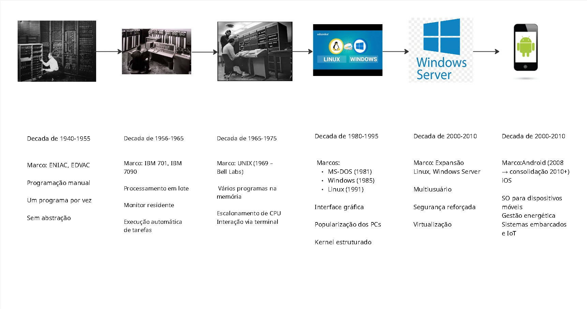

# Sistemas Operacionais -- Resumo e Linha do Tempo Histórica

## 📘 Resumo da Disciplina

A disciplina de **Sistemas Operacionais** estuda os fundamentos,
estruturas e funcionalidades dos sistemas operacionais, destacando seu
papel como intermediário entre hardware e software.

O foco principal está no gerenciamento de:

-   Processos
-   Memória
-   Dispositivos
-   Arquivos
-   Segurança e desempenho

São abordados temas como kernel, modos de operação (usuário e kernel),
escalonamento de CPU, multitarefa, memória virtual, paginação e
segmentação, com análises práticas em sistemas como Windows e Linux.

------------------------------------------------------------------------

## 🕰️ Linha do Tempo Histórica dos Sistemas Operacionais

> ⚠️ Após exportar sua linha do tempo do Miro como
> `linha-do-tempo.jpeg`, coloque a imagem na mesma pasta deste arquivo.

------------------------------------------------------------------------

## 📌 Marcos Históricos

### 1940--1955 -- Computação Sem SO

Execução direta no hardware, programação manual e ausência de abstração.

### 1956--1965 -- Sistemas Batch

Processamento em lote e surgimento dos primeiros monitores residentes.

### 1965--1975 -- Multiprogramação e UNIX

Criação do UNIX (1969), surgimento do conceito de processo e
escalonamento de CPU.

### 1980--1995 -- Sistemas Pessoais

Popularização do MS-DOS, Windows e Linux, além da expansão das
interfaces gráficas.

### 2000--2010 -- Servidores e Virtualização

Expansão de sistemas em rede, multiusuário e técnicas de virtualização.

### 2010--Atualidade -- Sistemas Móveis e Embarcados

Consolidação de Android e iOS, além da presença de sistemas operacionais
em dispositivos IoT.

------------------------------------------------------------------------

## 🔎 Evolução Conceitual Observada

A evolução dos sistemas operacionais acompanha o aumento da complexidade
do hardware e das necessidades humanas:

-   Controle direto do hardware\
-   Automatização de tarefas\
-   Gerenciamento de múltiplos processos\
-   Abstração de memória\
-   Infraestrutura de rede\
-   Sistemas distribuídos e móveis

------------------------------------------------------------------------

## 📝 Conclusão

Os sistemas operacionais evoluíram de simples mecanismos de execução
para estruturas complexas responsáveis pela gestão eficiente de recursos
computacionais, sendo essenciais para o funcionamento de sistemas
modernos.
